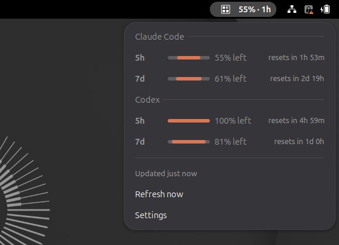

# Claude Code Usage Monitor for Linux


[](LICENSE)

See your Claude Code usage limits and reset times in the Linux top bar. It also
shows Codex, Cursor, OpenCode Go and Grok Build usage.

This is a Linux port of [CodeZeno/Claude-Code-Usage-Monitor](https://github.com/CodeZeno/Claude-Code-Usage-Monitor),
a Windows taskbar widget. The provider logic is the same; the Windows widget is
replaced by a small background daemon and a native GNOME Shell extension.




## Features

- Shows the usage closest to its limit, for example `42% · 3h`, in the GNOME top bar
- Turns amber and red near a limit, with an optional usage bar
- Lists every window (5-hour, weekly, monthly, credits) with its reset time
- Counts usage up from zero or down from the full allowance
- Supports several Claude Code and Codex accounts
- Works with waybar and scripts through JSON output and D-Bus
- Collects no analytics or telemetry

## Install

```sh
curl -fsSL https://raw.githubusercontent.com/pieterhelsen/Claude-Code-Usage-Monitor-for-Linux/main/packaging/install.sh | sh
```

The script installs everything into your home directory; it never needs root.
It downloads the latest release and checks its SHA-256 checksum. It then
installs the daemon to `~/.local/bin` and registers it with D-Bus and
systemd. On GNOME it also installs and enables the extension.

On GNOME with Wayland, **log out and back in** afterwards: GNOME only loads new
extensions at login.

Other options:

```sh
# a specific version, or without the GNOME extension
curl -fsSL …/install.sh | sh -s -- --version v1.0.0
curl -fsSL …/install.sh | sh -s -- --no-extension

# from a checkout (needs Rust from https://rustup.rs)
git clone https://github.com/pieterhelsen/Claude-Code-Usage-Monitor-for-Linux
cd Claude-Code-Usage-Monitor-for-Linux && sh packaging/install.sh --from-source

# remove it again (--purge also deletes settings and caches)
sh packaging/install.sh --uninstall --purge
```

Release builds run on x86_64 and aarch64 with glibc 2.35 or newer, which covers
Ubuntu 22.04, Debian 12, Fedora 36 and later.

## Desktop support

The daemon works on any Linux desktop. Only the panel front end differs.

| Desktop | Distributions | Status |
| --- | --- | --- |
| GNOME Shell 46–50 | Ubuntu 24.04+, Fedora 40+, Debian 13 | Top-bar extension, included |
| waybar (sway, Hyprland) | Arch, NixOS, Fedora spins | Custom module, see below |
| KDE Plasma, XFCE, Cinnamon, MATE | Kubuntu, Mint, openSUSE | Planned: tray icon and plasmoid |

### waybar

```jsonc
"custom/claude": {
    "exec": "claude-code-usage-monitor --waybar",
    "return-type": "json",
    "interval": 60,
    "on-click": "claude-code-usage-monitor --refresh"
}
```

The module reads from the daemon, so waybar never triggers extra requests to
the providers. The CSS classes are `ok`, `warn`, `critical`, `stale` and `error`.

## Provider setup

Enable providers in the extension's **Settings** (Providers page). Each one
reads the login its own CLI or app already stored on this computer.

| Provider | Credentials read from |
| --- | --- |
| Claude Code | `~/.claude/.credentials.json`, or `$CLAUDE_CONFIG_DIR/.credentials.json` |
| Codex | `~/.codex/auth.json`, or `$CODEX_HOME/auth.json` |
| Cursor | `~/.config/Cursor/User/globalStorage/state.vscdb`, or `CURSOR_SESSION_TOKEN` |
| OpenCode Go | `OPENCODE_GO_WORKSPACE_ID` + `OPENCODE_GO_AUTH_COOKIE`, or `~/.config/opencode-go/config.json` |
| Grok Build | `~/.grok/auth.json`, or `$GROK_HOME/auth.json` |

When a Claude Code, Codex or Grok login expires, the daemon asks that CLI to
renew it by running it once in the background. The CLI must be on your `PATH`
or in `~/.local/bin`. For Claude Code and Codex this sends one tiny prompt. It
runs in an empty private directory with tools, hooks and saved sessions turned
off where the CLI allows it. Codex still runs your user-level hooks.

For OpenCode Go, the config file looks like this:

```json
{
  "workspaceId": "wrk_01...",
  "authCookie": "__Host-console_session=your-session-cookie-value"
}
```

The workspace ID is part of the console URL, `https://opencode.ai/console/<workspaceId>/go`.
Copy the `__Host-console_session` cookie from a signed-in browser session. Protect
this file like a browser cookie.

Google Antigravity and the Claude desktop app's own login are Windows-only in
the original project and are not supported here.

## Command line

```text
claude-code-usage-monitor --json       usage snapshot as JSON
claude-code-usage-monitor --waybar     one line for a waybar custom module
claude-code-usage-monitor --refresh    ask the daemon to poll now
claude-code-usage-monitor --daemon     run the background service (normally automatic)
```

`--json` and `--waybar` read from the running daemon and start it if needed.
Add `--local` to poll the providers directly instead.

## How it works

`claude-code-usage-monitor --daemon` polls the enabled providers every 15
minutes by default. It also polls when a window resets and when a login file
changes. It publishes the result on the session D-Bus:

```text
name       io.github.pieterhelsen.ClaudeCodeUsageMonitor
object     /io/github/pieterhelsen/ClaudeCodeUsageMonitor
interface  io.github.pieterhelsen.ClaudeCodeUsageMonitor1
  GetUsage() → s           the usage snapshot as JSON (schema_version 1)
  Refresh()
  GetSettings() → s
  SetSettings(s) → s
  signal UsageChanged(s)
```

D-Bus starts the daemon on first use, through the systemd user unit
`claude-code-usage-monitor.service`. The snapshot format is documented in
`src/snapshot.rs`.

## Data and privacy

The daemon reads local sign-in files for the providers you enable. It sends
usage requests directly to each provider's official service. There is no
backend, no telemetry, and credentials and project files are never uploaded.
Credential files are read, never rewritten.

## Troubleshooting

- **The label shows `—`.** The daemon is not reachable. Check it with
  `systemctl --user status claude-code-usage-monitor` and
  `journalctl --user -u claude-code-usage-monitor`.
- **The label shows `!`.** The provider returned an error. Open the menu to read it;
  most often the CLI needs a fresh login.
- **Nothing appears in the top bar after installing.** Log out and back in, then
  check that the extension is enabled in the Extensions app.
- **Extension errors.** Run `journalctl --user -f -o cat /usr/bin/gnome-shell`.

For a detailed log, restart the daemon with diagnostics on:

```sh
claude-code-usage-monitor --quit
claude-code-usage-monitor --daemon --diagnose
```

The log is written to `~/.cache/claude-code-usage-monitor/diagnose.log`.

## Development

```sh
cargo test                                  # Rust tests (125)
node --test gnome-extension/test/*.mjs      # extension formatting tests
tools/extension-sandbox.sh                  # load the extension in a headless GNOME Shell
```

`tools/extension-sandbox.sh` runs a separate, headless GNOME Shell with its own
settings and screenshots the panel, the menu and the preferences. Your desktop
session is not touched.

See the [user guide](USER_GUIDE.md) for settings, and the [changelog](CHANGELOG.md).

## License

MIT, like the original project. See [LICENSE](LICENSE).
